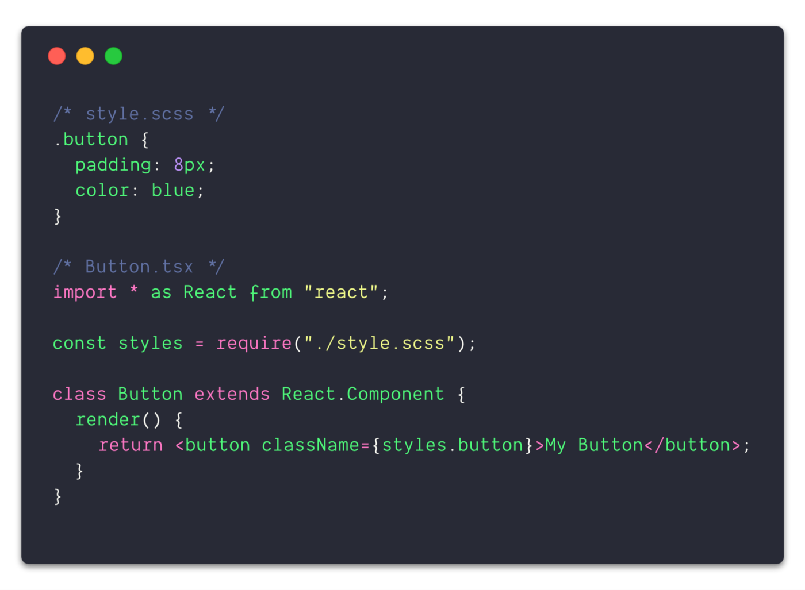
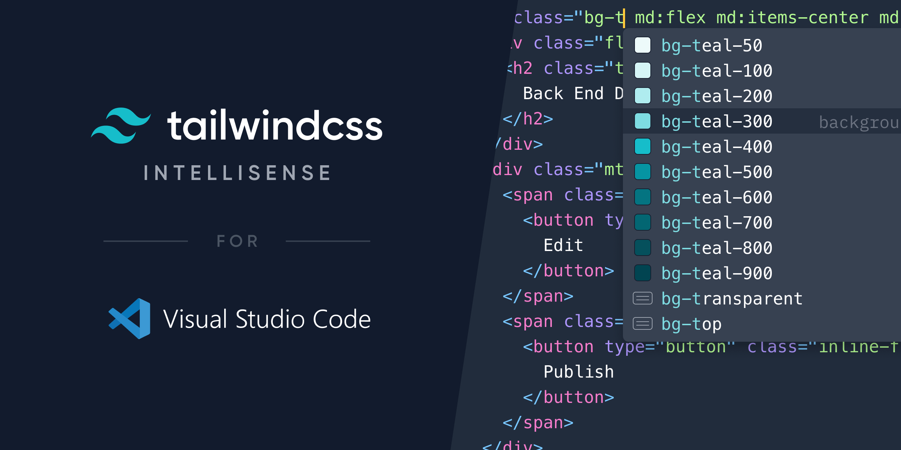
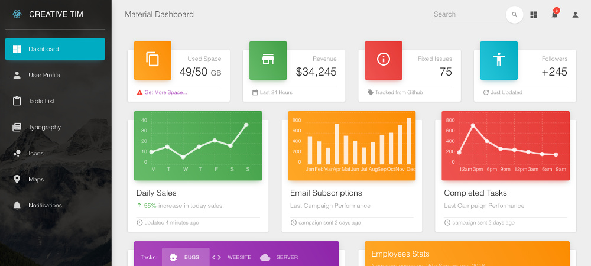
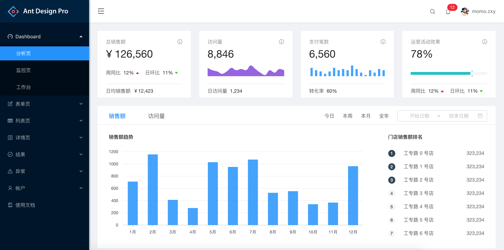

# About
- ## Module CSS
- ## Tailwind
- ## Materia UI : MUI
- ## Ant Design

# Module CSS
## In the past, web developers spent a lot of time and effort re-creating components. Any problem is found in CSS and the nature of its cascades.

# Tailwind
## Tailwind CSS makes it quicker to write and maintain the code of your application. By using this utility-first framework, you don't have to write custom CSS to style your application. 

# Material UI
## Material UI is an open-source React component library that implements Google's Material Design. It includes a comprehensive collection of prebuilt components that are ready for use in production right out of the box.

# Ant Design
## Ant Design is a popular design system for developing enterprise products. The comprehensive component library has everything product teams need to solve most modern B2B design problems.

